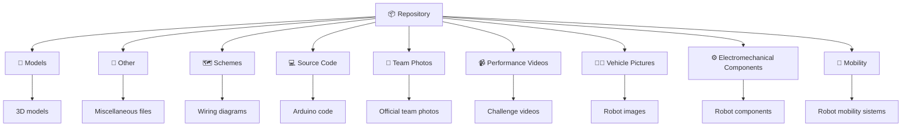
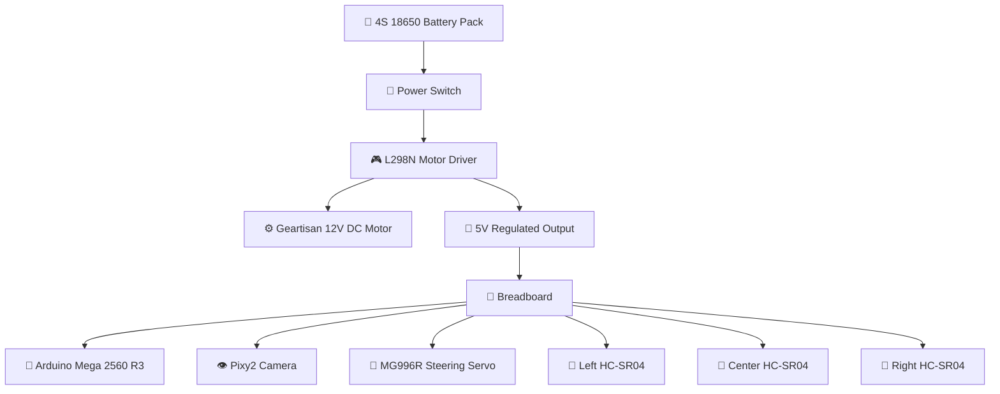

# CSA-West-Robotics-WRO-FE-2026
Our repository for WRO future engineers category for this 2026 season

## 📂 Repo's Folder Structure/Overview

### 🚀 Quick Access

- 🧊 **Models** → [Open Folder](models/)
- 📁 **Other** → [Open Folder](others/)
- 🗺️ **Schemes** → [Open Folder](schemes/)
- 💻 **Source Code** → [Open Folder](src/)
- 📸 **Team Photos** → [Open Folder](t-photos/)
- 📹 **Performance Videos** → [Open Folder](p-videos/)
- 🤖🚗 **Vehicle Pictures** → [Open Folder](v-photos/)
- ⚙️ **Electromechanical Components** → [Open Folder](electromechanical-components/)
- 🚗 **Mobility** → [Open Section](mobility/)

## 🧰 Engineering Materiales
All the materials used to create pur rpbot
- [Arduino Mega 2560 R3](https://docs.arduino.cc/resources/datasheets/A000067-datasheet.pdf) 
- 1 [Pixy2 Cam](https://pixycam-com.translate.goog/pixy2/?_x_tr_sl=en&_x_tr_tl=es&_x_tr_hl=es&_x_tr_pto=tc)
- 1 [L298n Motor Driver Board Module](https://naylampmechatronics.com/blog/11_tutorial-de-uso-del-modulo-l298n.html)
- 3 [Ultrasonic Sensors HC-SR04](https://www.amazon.com/-/es/ultrasónico-HC-SR04-detector-distancia-Arduino/dp/B09PBJ4ZY1)
- 1 Small on/off switch
- 1 Push Botton
- 1 Red LED for power indicator
- 1 Resistor ( Ohms) for the power indicator LED
- 26 Proto Wires
- 1 Fuse (1A)
- 1 Fuse Holder
- 1 Power Supply (More of this could be seen on Power Management)
    - 4 Cases of 1 18650 Batteries connected in series
    - 4 18650 3.7V 2800mAh Battery 
- 1 Chasis
    - 4 Wheels
    - 1 [Greartisan DC 12V 300RPM Motor](https://honestforwarder.com/product/greartisan-dc-12v-300rpm-geared-motor-high-torque-electric-micro-speed-reduction-gear-motor-eccentric-output-shaft-37-mm-diameter-gear-D4DQXkS1zP)
    - 1 [MG 996r Servo](https://www.amazon.com/dp/B09BZ5955Z?psc=1&ref_=cm_sw_r_cp_ud_ct_M9EZM05VN4JMKBB2R17X)
    - [Multiply 3d pieces that can be found in the following directory](models/)

## 🛠️ Building instructions
- Most of the chasis was printed in 3D, but there are some supports from the [YFROBOT Kit Chassis](https://yfrobot.com/products/steering-gear-robot).
- Electronics (Circuit and battery): [The circuit diagram can be found in the schemes directory](schemes/)
- Code (For the arduino): [The source code can be found in the src directory](src/)

## 👋 Introduction
Brief intro to our solution

For our robotics competition, we developed an innovative autonomous navigation solution that combines computer vision, distance sensing, and precise motion control. Our robot leverages Arduino's vision capabilities through a Pixy2 camera module to detect and interpret color signals placed along the competition field. These signals serve as navigation markers that determine the robot's next movement: a green signal instructs the robot to perform a left turn, while a red signal indicates a right turn. This vision-based approach allows the robot to make accurate decisions in real time while navigating the course.

To improve its environmental awareness and overall maneuverability, the robot is equipped with three ultrasonic sensors, all strategically positioned on the front side. These sensors continuously measure the distance to nearby objects, enabling the robot to detect obstacles, maintain safe navigation, and react quickly to changes in its surroundings. By combining information from the camera and ultrasonic sensors, the robot can simultaneously follow the competition's navigation rules while avoiding collisions.

Our solution demonstrates the effective integration of computer vision, sensor-based perception, and autonomous control algorithms to achieve reliable, accurate, and efficient navigation. This combination of technologies allows the robot to perform consistently in dynamic environments, making it a robust solution for robotics competitions that require both precision and adaptability.

## WRO 2026 Future Engineer Challenge
The WRO 2025 Future Engineers category invites teams to develop a fully autonomous vehicle capable of completing a dynamic driving course. Throughout the competition, the robot must rely on a combination of sensors, computer vision, and intelligent control algorithms to navigate the track, react to randomized elements, and execute precise driving maneuvers without human intervention.

### 📌 Competition Overview
#### 🏁 Open Challenge:

During this stage, the robot is required to complete three full laps around the track. Since the layout includes randomly placed obstacles and changing conditions, the robot must continuously analyze its environment and adapt its navigation strategy in real time.

#### 🚦 Obstacle Challenge:
In addition to navigating the course, the robot must recognize colored traffic markers placed at random positions along the track and react according to the competition rules:

🟥 Red marker: The robot must pass on the right side.

🟩 Green marker: The robot must pass on the left side.

Once the three laps are completed, the robot must locate the designated parking area and successfully perform a parallel parking maneuver inside the marked space, demonstrating a high level of positioning accuracy and vehicle control.

### 📑 Engineering Documentation
Every participating team must maintain a public GitHub repository containing detailed documentation of the project. This includes the robot's mechanical and electronic design, software implementation, engineering decisions, development process, and source code. The purpose of this requirement is to encourage knowledge sharing, transparency, and collaboration within the robotics community.

### 🏆 Evaluation Criteria
Robots are assessed based on several factors, including navigation accuracy, completion time, and the quality of the technical documentation provided by the team. Additional emphasis is placed on the robot's ability to adapt to randomized scenarios while maintaining consistent performance and demonstrating innovative engineering solutions. Beyond technical excellence, the challenge also promotes teamwork, creativity, and effective problem-solving skills.

## 🚗 Mobility
Our robot uses an Ackermann steering system, a steering geometry commonly found in real automobiles. This configuration allows the robot to perform smooth and controlled turns by steering only the front wheels, while the rear wheels are responsible for propulsion through a rigid rear axle.

The steering mechanism is actuated by an MG996R high-torque servo motor, which is directly connected to the custom-designed Ackermann linkage. Based on the navigation decisions made by the Arduino Mega 2560 R3, the servo adjusts the steering angle, allowing the robot to accurately follow the track, avoid obstacles, and execute the required maneuvers during the competition.

Propulsion is provided by a Geartisan 12V 300 RPM DC gear motor, which transmits power to the rigid rear axle. This configuration separates the steering and driving systems, resulting in smoother motion and more predictable vehicle behavior.

One of the main advantages of the Ackermann steering geometry is that it reduces wheel slip while turning. Since the front wheels follow different turning radii, the robot can navigate curves more efficiently and maintain better traction throughout the course. This improves stability, minimizes unnecessary tire wear, and allows for more precise obstacle avoidance and parking maneuvers.

The entire chassis was designed around this steering architecture, with most structural components manufactured using 3D printing. This allowed us to optimize the placement of the steering system, electronics, and drive components while keeping the robot lightweight, modular, and easy to maintain.

Overall, the combination of a dedicated steering servo, a rear-wheel drive system, and an Ackermann steering mechanism provides reliable handling, accurate trajectory tracking, and consistent performance throughout the WRO Future Engineers challenge.

### RWD System
- [RWD Robot System](mobility/rwd-system/)

### Ackerman Steering Mechanism
- [Ackerman Robot Steering](mobility/steering-mechanism/)

## 🎯 Strategy
Strategy Explanation
### Color Detection with Pixy2 Cam:
We integrated a Pixy2 Cam with the Arduino Mega 2560 R3 to accurately detect colors. This system allows the robot to recognize green and red colors, which serve as signals to turn left or right, respectively. By using a camera module and appropriate color detection algorithms, the robot can continuously monitor its environment and respond in real time.

### Directional Decision Making:
Upon detecting the color green, the robot is programmed to turn left. Conversely, when red is detected, the robot turns right. This color-based decision-making process ensures that the robot navigates efficiently and avoids obstacles or follows a designated path based on the predefined color signals.

### Border Detection and Turning:
In addition to color detection, our robot is equipped with ultrasonic sensors to identify the moment when it should turn. It uses an "umbral" which is a certain distance which if the robot pases, it will start to turn to a certain direction. That direction is decided by the other two ultrasonic sensors to the left and to the right.

### Implementation Details Code and Integration:
Our code, available here, outlines the specific algorithms and logic used for color detection, decision-making, and obstacle avoidance. The integration of the vision system with Arduino's control mechanisms is crucial for the robot's functionality.

### Color Detection Algorithm:
.......

### Obstacle Avoidance Routine:
.......

## Code Explanation
........

## ⚙️ Electromechanical Components
The robot was designed with a modular electromechanical architecture that combines reliable hardware, custom 3D-printed parts, and efficient power distribution. Every component was selected to provide stability, ease of maintenance, and consistent performance throughout the competition.

### 🔋 Power System
The robot is powered by a 4-cell (4S) 18650 lithium battery pack, which supplies the energy required for all electronic and mechanical components. The battery holder includes an integrated power switch, allowing the entire robot to be turned on safely before each run.

The battery pack is connected directly to the L298N motor driver through its +12V and GND terminals. The onboard 5V regulator of the L298N is then used to power a breadboard, which distributes power to the Arduino, sensors, and the remaining electronic devices.

To improve usability during competitions, the robot also includes a push button that starts the autonomous program after the robot has been powered on.

[📷 Power System Image](electromechanical-components/battery/)

### 🧠 Main Controller

The main controller of the robot is an Arduino Mega 2560 R3, which acts as the central processing unit of the entire system. It receives information from the vision system and ultrasonic sensors, processes all navigation decisions, and controls the motors accordingly.

Its compact size, processing capability, and reliable I/O communication make it an excellent choice for autonomous robotics applications.

[📷 Arduino Mega 2560 R3 Image](electromechanical-components/arduino/)

### 👁️ Vision System

The robot uses a Pixy2 Camera to detect the colored obstacle markers placed around the track.

A custom vision algorithm allows the camera to distinguish between red and green objects. Once a color is identified, the corresponding information is transmitted to the Arduino Nano 33 IoT, which decides whether the robot should turn left or right according to the competition rules.

#### Communication protocol: ...

#### Detection algorithm: ...

[📷 Pixy2 Camera Image](electromechanical-components/pixy2/)

### 📏 Ultrasonic Sensors

Three HC-SR04 ultrasonic sensors are mounted across the front of the robot.

These sensors continuously measure the distance between the robot and nearby walls or obstacles, allowing the robot to navigate safely through the track.

Each HC-SR04 sensor provides non-contact distance measurements from approximately 2 cm to 400 cm, with an accuracy of up to 3 mm.

The sensor arrangement consists of:
- Left ultrasonic sensor
- Center ultrasonic sensor
- Right ultrasonic sensor

Together, these sensors provide the robot with a wider field of view, enabling more accurate obstacle avoidance and wall-following behavior.

[📷 Ultrasonic Sensors](electromechanical-components/ultrasonic-sensors/)

### ⚙️ Drive System
#### DC Motor
The robot is driven by Geartisan 12V 300 RPM DC gear motors.

These motors provide a good balance between speed and torque, allowing smooth movement while maintaining enough power for acceleration, turning, and obstacle avoidance during the competition.

Specifications
- Voltage: 12 V
- Speed: 300 RPM
- Encoder: No

[📷 DC Motor](electromechanical-components/motors/dc-motor/)

#### Servo Motor
The robot uses an MG996R high-torque servo motor to control the steering mechanism of the front wheels. Unlike differential-drive robots, our vehicle follows an Ackermann-inspired steering configuration, allowing it to perform smoother and more realistic turns while maintaining stability throughout the course.

The Arduino Mega 2560 R3 continuously calculates the desired steering angle using data from the Pixy2 camera and the ultrasonic sensors. Based on this information, the servo precisely adjusts the front wheels, enabling the robot to navigate around obstacles, follow the track, and execute accurate parking maneuvers.

The MG996R was selected because of its high torque, fast response, and reliable performance, making it well suited for the steering demands of the WRO Future Engineers challenge.

Specifications:
- Model: MG996R
- Operating Voltage: 4.8–7.2 V
- Control Signal: PWM
- Type: High-Torque Digital Servo

[📷 Servo Motor](electromechanical-components/motors/servo-motor/)

### 🎮 Motor Driver

Motor control is performed using an L298N Dual H-Bridge Motor Driver.

The driver receives movement commands from the Arduino Mega 2560 R3 and regulates the motors accordingly. Besides driving the motors, the L298N also provides a regulated 5V output, which is used to power the breadboard and the robot's low-voltage electronics.

The L298N was selected because it is reliable, easy to integrate, and widely used in educational and robotics projects.

[📷 Motor Driver](electromechanical-components/motor-driver/)

### 🏗️ Mechanical Structure

The chassis was entirely designed by our team and manufactured primarily using 3D printing.

Almost every structural component of the robot is custom-made, allowing us to optimize the placement of electronics, reduce weight, simplify maintenance, and adapt the robot specifically for the WRO Future Engineers challenge.

Only the structural supports and steering mechanism were not 3D printed.

The robot includes:
- 4 wheels
- 8 structural supports
- Structural mounting screws
- Custom 3D-printed chassis

This modular design allows individual components to be replaced quickly without rebuilding the entire robot.

### 🔌 Wiring Diagram

The electrical connections between all components are summarized in the wiring diagram below.

(Insert wiring diagram here.)

### 📸 Component Gallery
The following folder shows images of all the main electromechanical components used in the robot.
- [Electromechanical Components](elechtromechanical-components/)

## ⚡ Power Management
A reliable power distribution system is essential to ensure stable operation of both the electronic and mechanical components during the competition.

The robot is powered by a **4S 18650 lithium battery pack**, which supplies the main power source for the entire system. The battery output is connected directly to the **L298N motor driver** through its **+12V** and **GND** terminals. This allows the driver to power the DC motors while simultaneously providing a regulated **5V output**.

The regulated **5V** and **GND** outputs from the L298N are connected to a **breadboard**, which acts as the central power distribution point for the low-voltage electronics. From there, power is supplied to the **Arduino Mega 2560 R3**, the **Pixy2 camera**, the **MG996R steering servo**, and the **HC-SR04 ultrasonic sensors**.

To improve safety and usability, the robot includes a **main power switch** that disconnects the battery from the entire electrical system when not in use. Additionally, a dedicated **start button** allows the robot to remain powered while delaying the execution of the autonomous program until the official start signal is given.

This power management architecture simplifies wiring, centralizes power distribution, and ensures that all electronic components receive a stable supply voltage throughout the robot's operation.

### ⚡ Power Management Diagram

